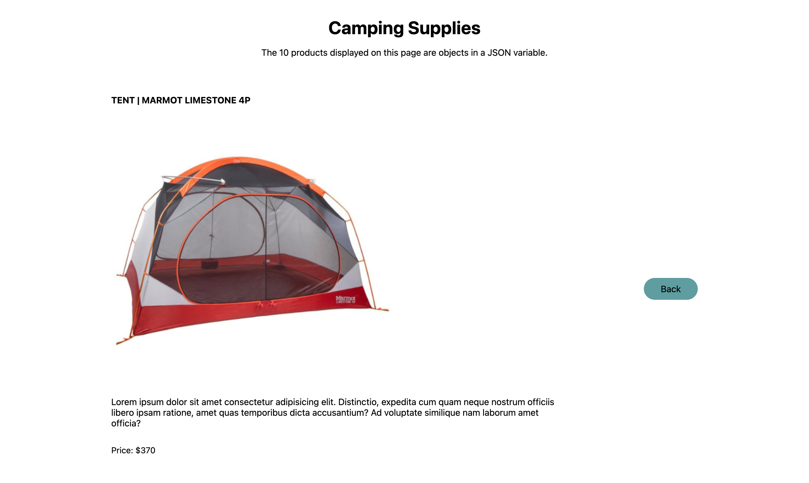
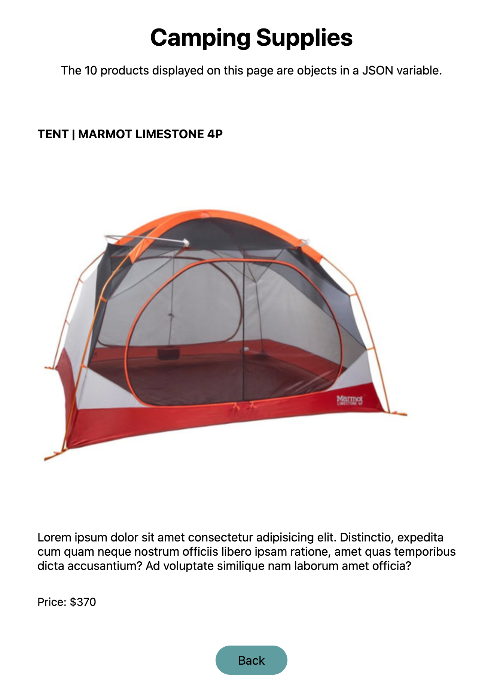

# Camping Supplies

> View Site: [Camping Supplies Site](https://fanciful-cobbler-defa78.netlify.app/)

## Table of Contents
- [About](#about)
- [Features/Tools](#featurestools)
- [Previews (Images)](#previews)
    - [Pages](#pages)
    - [Media Queries](#media-queries)
       - [Desktop View](#desktop-view)
       - [Tablet View](#tablet-view)
       - [Mobile View](#mobile-view)

## About 

Simple SPA displaying JSON variable objects information on HTML page. Home page for a camping supplies shop. Products for sale stored in JSON variable are looped through and displayed in a photo gallery style. Information for a specific product is dynamically loaded and displayed when the product is clicked on.  

## Features/Tools

<a href="#table-of-contents">back to top</a>

| Feature/Tool | Link | About |
| --- | ---| ---|
| CSS Preprocessor: SaSS/ScSS | [sass-lang.com](https://sass-lang.com/) | Preprocessor scripting language interpreted/compiled into Cascading Style Sheets (CSS) |
| PrePros | [prepros.io](https://prepros.io/) | Compiler for SaSS/ScSS/CSS|
| JavaScript | [Mozilla Developer Docs: What is JavaScript](https://developer.mozilla.org/en-US/docs/Learn/JavaScript/First_steps/What_is_JavaScript) | Scripting language that enables creation of dynamically updating content, control multimedia, animate images, etc. |
| jQuery | [jquery.com](https://jquery.com/) | Fast, small, & feature-rich JavaScript library that makes things like HTML document traversal and manipulation, event handling, animation, and Ajax simpler with an easy-to-use API that works across a multitude of browsers |
| HTML | [Mozilla Developer Docs: HTMl](https://developer.mozilla.org/en-US/docs/Web/HTML) | Markup language used to structure and give meaning to web content |
| CSS | [Mozilla Developer Docs: CSS](https://developer.mozilla.org/en-US/docs/Web/CSS) | Language of style rules used to apply styling to HTML content |
| Netlify | [netlify.com](https://www.netlify.com/)| Deployed to Netlify via GitHub |

## Previews

<a href="#table-of-contents">back to top</a>

Screenshot/screen capture images of the site. Site can also be viewed live at [Camping Supplies Site](https://fanciful-cobbler-defa78.netlify.app/)

### Pages

| Home | Product Details |
| --- | --- |
| | |

### Media Queries

<a href="#table-of-contents">back to top</a>

<h3>Desktop View</h3>

<a href="#table-of-contents">back to top</a>

|Skip to page: | [Home](#home-on-desktop)|[Product Details](#product-details-on-desktop)|
|---| --- | --- |

#### Home on Desktop

---

#### Product Details on Desktop

<h3>Tablet View</h3>

<a href="#table-of-contents">back to top</a>

|Skip to page: | [Home](#home-on-tablet)|[Product Details](#product-details-on-tablet)|
|---| --- | --- |

#### Home on Tablet

---

#### Product Details on Tablet

<h3>Mobile View</h3>

|Skip to page: | [Home](#home-on-mobile)|[Product Details](#product-details-on-mobile)|
|---| --- | --- |

<a href="#table-of-contents">back to top</a>

#### Home on Mobile

---

#### Product Details on Mobile

